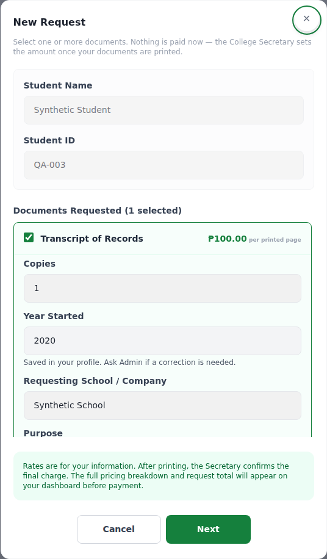
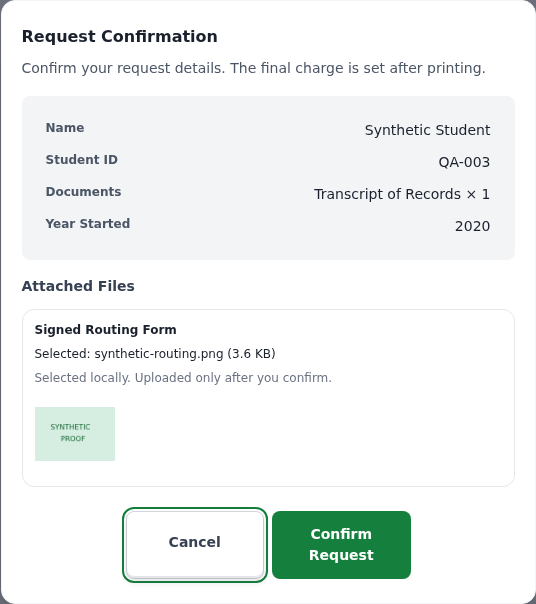

# Revision 2 Batch 7 — alumni registration and request forms

This batch implements TRACE-52, TRACE-53, TRACE-54, TRACE-75 and TRACE-76 from the new-fixes guide. It follows the main TRACE Figma form and confirmation frames and is prepared for `dev` only. Pricing, staff routing, chat design, reports and Finance receipt work belong to their later guide batches.

## What changed and why

The request form previously kept editable start/end years in each document draft, while the profile lacked a saved Year Started. Alumni registration did not persist the year pair. That allowed repeated entry, inconsistent values and client-supplied request years. Registration now saves Year Started and Year Graduated once; existing alumni complete missing fields in Edit Profile. Student requests use the locked saved profile. Year Ended has no field, payload requirement or validation in new student requests. Historical request details are preserved.

Both study years must contain four digits from 2002 through the current Manila year. Graduation cannot precede starting or exceed it by more than ten years. These interval rules belong to registration/profile completion and Admin corrections, not a request end-year field. Current students can leave graduation blank; request types that need a graduation/last-attendance year use the existing saved value.

Saved nonblank study years are read-only for students. Admin opens a student from Users, selects **Correct Study Years**, reviews the saved values, enters corrected values and a reason, then confirms. The service locks the account and commits the year change and before/after audit together. Failed audits roll back the correction. Unrelated saves preserve existing historical years; no migration infers missing values or rewrites old requests.

The optional alumni-only proof-unavailable defense path always creates a pending applicant and skips AI auto-approval. Admin records alternative identity evidence and the basis for approval/rejection. Approved alumni can sign in without historical document uploads; the existing profile, email and Graduate-application request gates remain. The flag defaults off and is forcibly disabled in production. Institution-approved production evidence rules remain outstanding.

The duplicate inner upload label is removed while retaining an accessible picker, file limits and previews. Reset Password has an eye icon inside each password input with independent state, native keyboard buttons and clear Show/Hide labels. Forgot Password's identifier step remains unchanged.

## Visual reference and screenshots

Main Figma file: [TRACE Draft](https://www.figma.com/design/78A3HTREQ86GIN9ZxvDBSv/TRACE-Draft?node-id=0-1). References: New Request `85:1514`, detailed Request Confirmation `177:691` and compact confirmation `183:741`. Forms reuse the shared controls, 535 px modal width, 14 px corners and centered Cancel/Confirm group. Review summaries and previews are dynamic. The approved multi-document selection and rates-only pricing remain; Figma's single-document select, estimated total and placeholder images are not substituted for working business data. Mobile, dark colors, readable contrast and reduced motion use the existing shared system.

All pictured users and files are synthetic. No account is needed to inspect them.

[Phone / dark-mode screenshot](batch7-request-mobile-dark.png). The form body and document options scroll independently; actions remain pinned.

## Short walkthrough

1. Register as Alumni with Year Started/Year Graduated and identity proof. Review the summary before submitting. With the nonproduction demo flag enabled, choose unavailable proof, explain why, and submit for pending review.
2. Admin opens the pending application, checks evidence, records the decision basis for missing-proof cases, and confirms the decision. Applicant approval and email verification remain separate.
3. An existing alumni signs in and completes missing study years in **Edit Profile → Educational Background**. Saved years are locked after completion; Admin performs corrections with an audit reason.
4. Open **New Request**, select TOR and inspect read-only Year Started. There is no Year Ended. Missing/invalid saved years disable Next and link to profile completion. Add a local attachment, choose Next, review the details/preview, then confirm. Cancel preserves the draft and file.
5. Open Reset Password from an emailed link. Toggle either eye icon; the other field keeps its own visibility and both values remain intact. Validation and confirmation still precede password reset.

## Verification and rollout limits

- Backend: **1,323 passing tests**, including saved-year authority, forged request values, student/Admin authorization, transaction rollback, bounded year intervals, demo production restrictions and audit writes.
- Frontend: **866 passing tests**, including one-time year entry, cancelled/failed confirmation drafts, correction review, duplicate-label cleanup, password icon behavior and proof-demo visibility.
- ESLint and production build pass. The build retains the existing PostCSS/large-bundle warnings.
- Chromium checked request, detailed/compact confirmation, signup, reset and Admin correction at **320 / 375 / 768 / 1440 px**, both themes: **48 layout cases**, no page overflow, visible modal action groups and no page errors. Additional checks covered 200% text, reduced motion and keyboard password toggling. Screenshots above were inspected against the references.
- Database/API responses were mocked or synthetic. A live MySQL migration, institution evidence-policy acceptance, real email/providers and a physical-phone check were not performed.

Before running the updated API, apply `backend/database/migrate_alumni_study_years.js` after its student-profile/graduation prerequisites, then `check_schema.js`. Use the matched rollout instructions in [MIGRATION_ROLLOUT.md](MIGRATION_ROLLOUT.md#revision-2-batch-7--alumni-study-years-2026-10-10). For isolated local defense rehearsals only, set `ALUMNI_PROOF_UNAVAILABLE_DEMO_ENABLED=true`; see [ENV_SETUP_GUIDE.md](ENV_SETUP_GUIDE.md#revision-2-batch-7-alumni-proof-unavailable-defense-option). This batch does not deploy or merge `main`.
