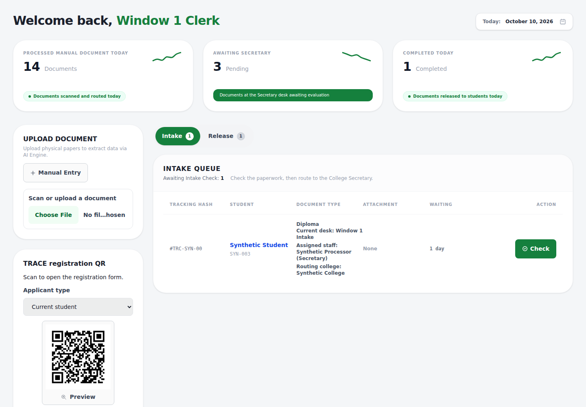
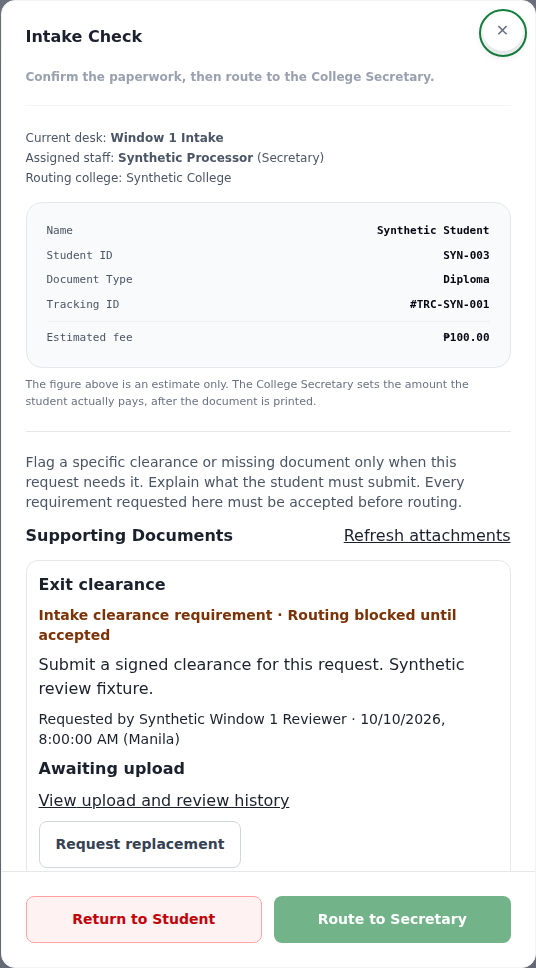
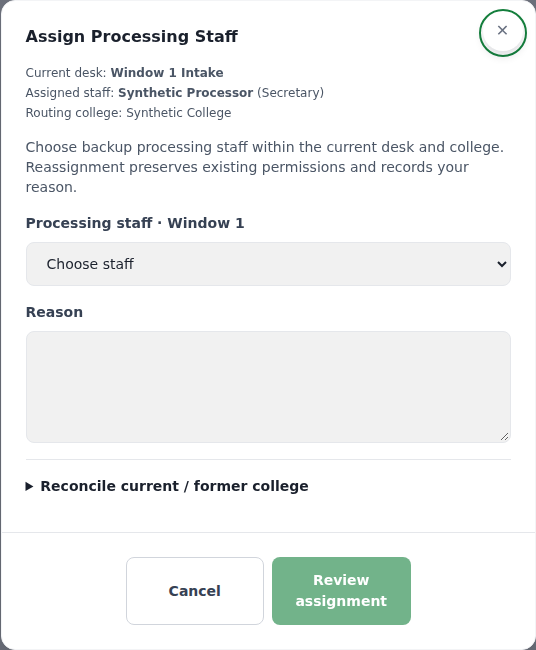
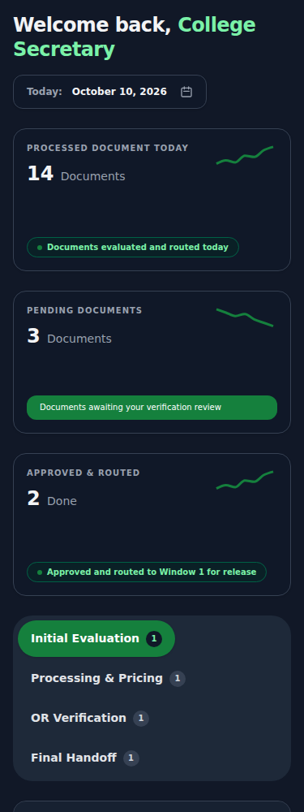

# Revision 2 Batch 8 — intake, college scope and processing staff

Implements the newer bug guide's **TRACE-55, TRACE-56, TRACE-57, TRACE-67 and TRACE-68**. This is separate from the older numbered batches. The next guide batch is Reports & Export (Batch 9).

## Main workflows — no account needed

The screenshots use synthetic records from the actual React components with mocked API responses. They let reviewers see the UI without a login; they do not establish that this branch is deployed or that a live database workflow has passed.

| Step | Action and result |
| --- | --- |
| Intake review | Window 1 inspects the document, student and recorded college before routing. If this particular request needs clearance or another missing document, choose a Registrar-approved supporting-document type, explain why and confirm the request. There is no universal clearance checklist. |
| Student follow-up | The existing requirement/ticket notification workflow tells the student what to submit. Window 1 reviews the submission and accepts it or asks for a correction. Requested, uploaded and rejected blocking requirements keep routing disabled; only acceptance clears the gate. Replacement history remains visible and audited. |
| College routing | The backend resolves exactly one active college from the student's saved profile. Alumni use their recorded former college. Routing saves a college snapshot so later profile edits cannot silently move the request. Missing, ambiguous or inactive college information requires Admin reconciliation rather than access to every college. |
| Admin reconciliation | In the Admin tracker, open Assign Staff and expand Reconcile current / former college when offered. Select the institutionally verified college, record evidence and review the confirmation. The backend derives the student from the request and checks the saved profile value under a lock. For an intake case, Window 1 must still review and route; for an open legacy case without a snapshot, the explicit correction fills its missing scope without advancing the stage. Existing snapshots and closed history cannot be rewritten here. |
| Backup assignment | Admin chooses an active clerk at the current processing desk; Secretary candidates must belong to the request's college. A reason and confirmation are required. A concurrent owner/stage change rejects the stale save. An assignment gives no additional role or college permission. Other same-desk staff can view within their existing scope but must obtain Admin reassignment before processing a request owned by a colleague. |
| Processing and handoff | The Secretary evaluates/prepares/prices; Finance verifies payment; the Secretary verifies OR paperwork and records physical handoff to Window 1. Handoff clears the outgoing assignment so the release queue can take ownership, while the prior actor and actions remain in audit history. Payment and OR prerequisites remain enforced. |









## UI and Figma

The visual foundation follows the main [TRACE Figma](https://www.figma.com/design/78A3HTREQ86GIN9ZxvDBSv/TRACE-Draft?node-id=92-1171): pine-green branding, white rounded surfaces and the existing modal/confirmation patterns. The Window 1 frame 92:1171 was inspected; existing form/confirmation references are 85:1514, 177:691 and 183:741. Figma does not specify the new clearance/assignment UI exactly, so these extend the shared TRACE components rather than inventing a different design style.

`QueueTabs` is shared across the role queues, Maintenance and applicable Student/history filters. True tabs have tablist/tab/tabpanel relationships and arrow/Home/End keyboard navigation. Filter controls use native buttons and pressed state. `QueuePanel` replays the shared context transition when the selection changes without remounting its forms. The Window 1 controls and queue have a 16 px shared gap. Fine-pointer hover lifts the pill's visual content and adds a soft shadow while keeping its native click target fixed; reduced motion removes movement. Labels/counts wrap at small widths and enlarged text sizes.

## Why the gaps existed

- Secretary college restrictions previously depended on the list's status-filter branch, could fall back to an unrestricted condition and could be bypassed by an assignment. List, report/export, detail, action and file access now enforce college scope independently.
- Intake checked policy attachments but did not gate routing on explicitly requested clearance. The saved `blocks_intake` flag connects existing requirement review to the routing transaction.
- Assignment callbacks could overwrite an owner or arrive after the stage had changed. Transaction locks, stage checks and snapshot comparisons protect routing and Admin assignment.
- Late OCR could replace a known student identity. OCR now fills an unknown intake identity while preserving a reviewed owner/document type.
- Local tab recipes had drifted, and adding an entrance class to a reused DOM element did not replay motion. Shared tab styles and keyed context motion make the change visible and consistent.

Public tracking now returns progress only. Authenticated detail and Secretary document/receipt downloads enforce role and college scope; private identity, file paths and internal notes are not returned through public tracking.

## Verification

- Full backend suite: **1,357 tests in 102 files passed**, followed by focused regressions for legacy reconciliation and concurrent profile corrections.
- Full frontend suite: **871 tests in 92 files passed**, followed by assignment-confirmation, intake-gate and shared-tab checks, including the new college-correction confirmation.
- ESLint, production build and `git diff --check` pass. The existing build chunk-size/PostCSS advisories remain.
- Chromium: **56 layout cases** across seven actual component/page modes, 320/375/768/1440 px and both themes. Additional checks cover 200% text, the visible context transition, the queue gap, a stationary native hover target and reduced motion. No page errors were observed.
- Regression coverage includes cross-college lists/details/files/actions, forged student IDs, saved routing scope, missing/inactive former colleges, stale assignment saves, late routing callbacks, blocking requirement review and public tracking redaction.

These are local mocked/unit and browser checks. Live MySQL migration/application acceptance, institutional record reconciliation, delivery of notifications and physical-phone/printer checks remain deployment acceptance work. No production migration or deployment was performed.

## Preserving database rollout

Follow [MIGRATION_ROLLOUT.md](MIGRATION_ROLLOUT.md) for backup, writer-stop and matched image/frontend rollout. If existing student profiles, graduation/alumni years, request attachments and Support requirements are already installed, the only new schema migration in this batch is:

```bash
node backend/database/migrate_request_intake_scope.js
node backend/database/check_schema.js
```

For a configured Compose deployment using the matching backend image:

```bash
docker compose run --rm --no-deps -T backend node database/migrate_request_intake_scope.js
docker compose run --rm --no-deps -T backend node database/check_schema.js
```

It adds nullable `documents.routing_college_id`, nullable `documents.routing_college_name` and `request_attachment_requirements.blocks_intake` defaulting to false. It is rerunnable and does not rewrite existing profiles, request history or requirements. Legacy requests without a snapshot use the authoritative profile/exact active college mapping; unresolved cases require the audited Admin correction above. Historical requirements are not retroactively made blocking. Do not import the fresh-install schema or seeds into an existing database. Apply the migration before starting the matching API and frontend.
