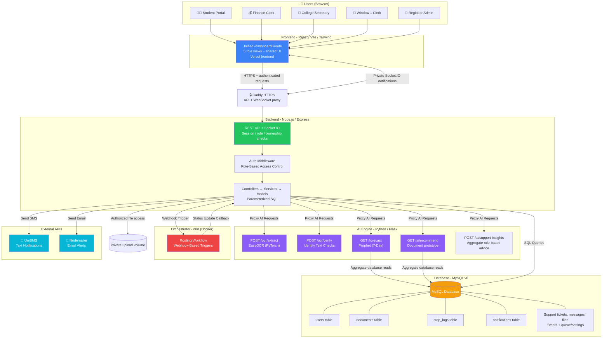
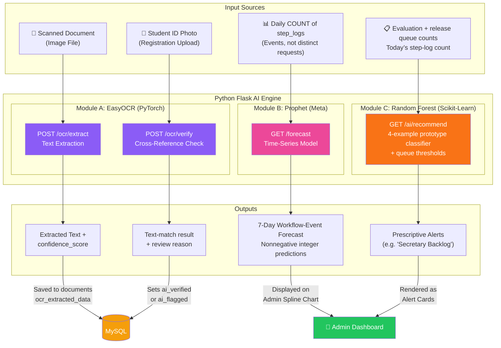
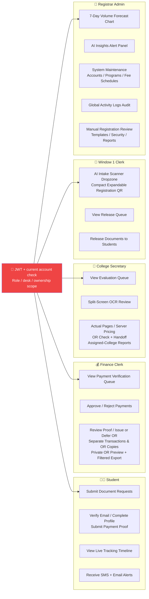

# Project TRACE: Ultimate Capstone Defense Guide 🎓

This guide is designed to help your team prepare for your final Capstone defense. It covers the core pitch, an in-depth breakdown of every technology, why each was chosen over alternatives, the DOs and DON'Ts of presenting, and a comprehensive bank of mock panel questions with scripted answers.

> 📌 **Content reviewed against the repository: October 6, 2026.** This preserves the original defense format and detailed question bank. Distinguish implemented code, local verification and the deployed version. Use [PROGRESS.md](PROGRESS.md) for evidence, [MIGRATION_ROLLOUT.md](MIGRATION_ROLLOUT.md) for deployment, and [SUPPORT_DESIGN.md](SUPPORT_DESIGN.md) for the implemented ticket policies. See [SUPPORT_VALIDATION.md](SUPPORT_VALIDATION.md) for local evidence; demonstrate only the matching deployed version.

---

## 🎯 1. Core Pitch: What is Project TRACE?

*   **The Problem:** Traditional university registrar offices suffer from manual data entry bottlenecks, lost paperwork, lack of transparency in document queuing, and zero predictive capacity for volume spikes. Students have no idea where their document is in the pipeline, and administrators have no data-driven tools to manage workloads.
*   **The Solution:** Project TRACE (**Tracking, Routing, and Automated Credential Engine**) is an **AI-Assisted Registrar Document Workflow System** built for the Pamantasan ng Lungsod ng Pasig (PLP) Registrar's Office. It digitizes physical paperwork using Optical Character Recognition (OCR), automates queue management via a strict Role-Based Access Control (RBAC) pipeline, sends real-time multi-channel notifications (SMS & Email), and uses prototype Machine Learning and queue-based insights to assist workload planning. Current forecast inputs are daily workflow-event counts; measured predictive accuracy and operational improvements require a separate evaluation.

---

## 📊 2. System Diagrams

Use these diagrams during your defense presentation. They visually explain the architecture, data flow, and access control so the panelists immediately grasp how the system works before you dive into code-level details.

### Diagram 1: System Architecture Overview
This shows the frontend, API, AI engine and optional routing integration, together with HTTPS, persistent private files and notifications. The current deployment uses Vercel for the frontend and Docker Compose/Caddy for the server services.

### Diagram 2: Document Lifecycle Pipeline

Nine statuses, **evaluate first and pay later**. Use this to explain the core workflow during the
demo — and be ready for the question it invites, which is *why* payment comes so late. The answer is
below the diagram.

```mermaid
flowchart LR
    A["🧑‍🎓 Student<br/>Files Request"] --> B["PENDING_W1_INTAKE"]
    W1["🏢 Window 1<br/>Walk-in at counter"] --> B
    B -->|"🏢 Window 1<br/>Checks paperwork, scans"| C["PENDING_SEC_EVALUATION"]
    C -->|"📜 Secretary<br/>Accepts + sets ready date"| D["SEC_PROCESSING"]
    D -->|"📜 Secretary<br/>Prints, then prices it"| E["PENDING_STUDENT_PAYMENT"]
    E -->|"🧑‍🎓 Pays online"| F["PENDING_FINANCE_VERIFICATION"]
    E -->|"💰 Finance logs<br/>counter payment"| F
    F -->|"💰 Finance verifies<br/>sets PAID"| G["PAID_PENDING_SEC_RELEASE"]
    F -->|"💰 Finance rejects"| E
    G -->|"📜 Secretary inspects<br/>issued Official Receipt"| OR["SEC_OR_VERIFIED"]
    OR -->|"📜 Secretary records<br/>physical handoff"| H["READY_FOR_RELEASE"]
    H -->|"🏢 Window 1 releases<br/>against the OR"| I["COMPLETED"]

    D -.->|"📱 SMS + 📧 Email<br/>Estimated ready date"| A
    E -.->|"📱 SMS + 📧 Email<br/>Amount due"| A
    H -.->|"📱 SMS + 📧 Email<br/>Ready for pickup"| A

    style A fill:#3b82f6,color:#fff
    style W1 fill:#3b82f6,color:#fff
    style B fill:#f59e0b,color:#fff
    style C fill:#8b5cf6,color:#fff
    style D fill:#8b5cf6,color:#fff
    style E fill:#f97316,color:#fff
    style F fill:#f97316,color:#fff
    style G fill:#22c55e,color:#fff
    style OR fill:#3b82f6,color:#fff
    style H fill:#22c55e,color:#fff
    style I fill:#10b981,color:#fff
```

**Why pricing follows preparation.** Page-based types use the actual printed-page count; flat-fee types use their configured rule. Admin manages rates and college overrides, Secretary records actual pages, and the server computes and saves the itemized final charge. Filing shows rates only, not an estimated total. TOR uses Year Started/Year Ended; study years do not imply pages. The old design charged a fee up front and hoped it matched; this one bills what
the document actually cost. It also means a student never pays for something the office later finds
it cannot issue.

**Two rules the panel will probe.** Rejection returns a document *exactly one step*, never to the
start — so the desk that can fix the problem is the one that receives it. Finance payment clearance is not undone by receipt inspection; refunds are handled off-system. Consult the shared transition map for permitted stage returns rather than inferring them from badge colors.

### Diagram 3: AI & Machine Learning Data Flow
This shows exactly how each AI/ML module receives data, processes it, and returns results to the system.

### Diagram 4: Role-Based Access Control (RBAC) Map
This shows exactly what each role can and cannot do in the system. Useful when a panelist asks about security or authorization.

### Diagram 5: Database Entity Relationship
This expands the original core-table diagram with the current profile, catalog, pricing, attachment and messaging relationships. It is a selected logical overview, not the full SQL schema. In particular, documents.student_id is a logical account reference rather than an enforced SQL foreign key. The ticket relationships below describe the local implementation; deploy its explicit preserving migrations before demonstrating it. Legacy message tables remain as preserved import sources.

```mermaid
erDiagram
    users ||--o{ support_tickets : "owns / handles"
    documents |o--o{ support_tickets : "optional case link"
    support_tickets ||--o{ support_ticket_messages : "conversation"
    support_ticket_messages ||--o{ support_ticket_files : "private attachments"
    support_tickets |o--o{ support_ticket_events : "durable lifecycle"
    supporting_document_types |o--o{ request_attachment_requirements : "approved identity"
    request_attachment_requirements |o--o{ request_attachment_events : "retained review history"
    users ||--o{ documents : "submits"
    users ||--o{ notifications : "receives"
    documents ||--o{ step_logs : "generates"
    users ||--o{ step_logs : "performs"

    users {
        INT id PK
        VARCHAR student_id UK
        VARCHAR email
        VARCHAR password_hash
        VARCHAR full_name
        ENUM role "student / clerk / admin"
        ENUM user_type "student / alumni"
        VARCHAR desk_assignment
        VARCHAR id_proof_path
        ENUM verification_status "pending / verified / rejected"
        VARCHAR course
        VARCHAR phone_number
        BOOLEAN is_active
    }

    documents {
        INT id PK
        VARCHAR tracking_number UK
        VARCHAR student_id "logical account reference"
        VARCHAR document_type
        VARCHAR current_status "PENDING_W1_INTAKE / SEC_PROCESSING / etc (9 stages + legacy values)"
        DATE estimated_ready_date "estimated date, not guarantee"
        INT page_count "basis for the charge"
        TEXT pricing_notes "why the amount is what it is"
        INT priced_by_clerk_id FK "which Secretary set it"
        DATETIME priced_at "gates billing, not `amount`"
        VARCHAR payment_channel "digital / walk_in"
        VARCHAR or_number "issued OR; may be deferred"
        JSON pricing_snapshot
        JSON fee_breakdown
        TIMESTAMP payment_cleared_at
        DATE or_earliest_issue_date
        VARCHAR official_receipt_path
        ENUM payment_status "UNPAID / PAID"
        VARCHAR file_path
        VARCHAR receipt_image_path
        VARCHAR gcash_reference_no
        DECIMAL amount
        INT copies
        DECIMAL ocr_confidence_score
        VARCHAR purpose
        JSON ocr_extracted_data
    }

    step_logs {
        INT id PK
        INT document_id FK
        INT clerk_id FK
        VARCHAR action_taken
        VARCHAR from_status
        VARCHAR to_status
        DATETIME timestamp_started
        DATETIME timestamp_completed
        TEXT notes
    }

    notifications {
        INT id PK
        INT user_id FK
        VARCHAR title
        TEXT message
        VARCHAR type
        BOOLEAN is_read
        TIMESTAMP created_at
    }

    users ||--o| student_profiles : "saved profile"
    colleges ||--o{ programs : "approved catalog"
    colleges ||--o{ users : "assigned college"
    document_types ||--o{ document_fee_schedules : "college overrides"
    documents ||--o{ document_messages : "request history"
    users ||--o{ support_messages : "general history"
    documents ||--o{ request_attachment_requirements : "case requirements"
    request_attachment_requirements ||--o{ request_attachment_uploads : "upload versions"
    users ||--o| authenticator_credentials : "encrypted factor"
    users ||--o{ authenticator_recovery_codes : "hashed recovery"
    users ||--o{ session_revocations : "revoked sessions"
    users ||--o{ security_logs : "account activity"

    student_profiles {
        INT user_id PK
        DATE birth_date
        VARCHAR home_address
        INT graduation_year "separate PLP year"
        INT last_attendance_year "not reclassified"
        INT elem_grad_year
        INT jhs_grad_year
        INT shs_grad_year
    }
    colleges {
        INT id PK
        VARCHAR name
        BOOLEAN is_active
    }
    programs {
        INT id PK
        INT college_id FK
        VARCHAR name
        BOOLEAN is_active
    }
    document_types {
        INT id PK
        VARCHAR name
        DECIMAL base_fee
        VARCHAR fee_rule
        BOOLEAN is_active
    }
    document_fee_schedules {
        INT id PK
        INT document_type_id FK
        INT college_id FK
        JSON fee_items
    }
    document_messages {
        INT id PK
        INT document_id FK
        INT sender_id FK
        VARCHAR message
        TIMESTAMP created_at
    }
    support_messages {
        INT id PK
        INT student_user_id FK
        INT sender_id FK
        VARCHAR message
        TIMESTAMP created_at
    }
    request_attachment_requirements {
        INT id PK
        INT document_id FK
        VARCHAR label
        VARCHAR instructions
        ENUM status
    }
    request_attachment_uploads {
        INT id PK
        INT requirement_id FK
        VARCHAR file_path
        VARCHAR original_filename
    }
    support_tickets {
        INT id PK
        INT student_user_id FK
        INT document_id FK "nullable after cancellation"
        ENUM state "FAQ / Queued / In progress / Awaiting / Resolved"
        INT assigned_to FK
        DATETIME queued_at
        DATETIME reply_requested_at
    }
    support_ticket_messages {
        BIGINT id PK
        INT ticket_id FK
        INT sender_id FK
        VARCHAR client_key "unique per sender"
        JSON metadata
    }
    support_ticket_files {
        BIGINT id PK
        BIGINT message_id FK
        VARCHAR filename UK "protected download"
    }
    support_ticket_events {
        BIGINT id PK
        INT ticket_id FK
        VARCHAR event_key UK
        VARCHAR event_type
        DATETIME created_at
    }
    supporting_document_types {
        INT id PK
        VARCHAR name UK
        BOOLEAN is_active
    }
    request_attachment_events {
        BIGINT id PK
        INT requirement_id FK "nullable after cancellation"
        JSON snapshot "original requirement/case identity"
        DATETIME created_at
    }
    authenticator_credentials {
        INT user_id PK
        TEXT active_secret "encrypted, never displayed"
        BIGINT last_counter
    }
    authenticator_recovery_codes {
        INT id PK
        INT user_id FK
        VARCHAR code_hash
        DATETIME used_at
    }
    session_revocations {
        VARCHAR token_hash PK
        INT user_id FK
        DATETIME expires_at
    }
    security_logs {
        INT id PK
        INT user_id FK
        VARCHAR event_type
        TIMESTAMP created_at
    }
```

---

## 🏗️ 3. Our Tech Stack (In-Depth Breakdown)

This section covers **what** each technology is, **how** it is used in our system, and **why** we chose it instead of alternatives. Memorize the "Why not alternatives" part — panelists love asking this.

### A. Frontend — React (Vite) + Tailwind CSS

| Aspect | Detail |
|:---|:---|
| **What it is** | React is a JavaScript UI library for building component-based interfaces. Vite is a modern build tool. Tailwind CSS is a utility-first CSS framework. |
| **How we use it** | We built a single unified `/dashboard` route that dynamically renders one of 5 different command centers (Student, Finance, Window 1, Secretary, Admin) based on the logged-in user's `role` and `desk_assignment`. Each portal has its own tabs, modals, and data grids — all wired to live API endpoints. |
| **Why React over plain HTML/JS?** | Our system has 5 role-based dashboards with complex interactive components (split-screen modals, live tracking timelines, dynamic forms). Plain HTML/JS would require manually managing DOM updates, leading to spaghetti code. React's virtual DOM and component model keep the codebase modular and maintainable. |
| **Why React over Angular or Vue?** | Our existing role components, hooks and team workflow use React. Angular and Vue are valid alternatives; this repository does not contain a comparative performance or productivity study. |
| **Why Vite over Create React App (CRA)?** | Vite provides the development server, HMR and production build for this React SPA. We use its existing alias/proxy setup and verify production builds; no measured speed comparison is claimed. |
| **Why Tailwind over Bootstrap or custom CSS?** | Tailwind supports our existing theme palette, responsive utilities and shared trace-* controls. Reusable conventions now keep buttons, fields, modal spacing, motion and dark mode aligned across roles. |

### B. Backend — Node.js + Express

| Aspect | Detail |
|:---|:---|
| **What it is** | Node.js is a JavaScript runtime built on Chrome's V8 engine. Express is a minimal web framework for building REST APIs. |
| **How we use it** | Express acts as our **API Gateway**. It handles JWT authentication, file uploads via Multer, all CRUD operations against MySQL, proxies requests to the Python AI Engine, and dispatches SMS/Email notifications. It also exposes webhook endpoints for n8n. |
| **Why Node.js over PHP (Laravel)?** | The team shares JavaScript across the React frontend and Express API. Asynchronous I/O and connection pooling support concurrent work, but capacity must be measured; other frameworks can also serve this workload. |
| **Why Node.js over Django (Python)?** | The chosen separation keeps OCR/model dependencies in Flask and the workflow API in Express. A separate AI service can fail or scale independently; Django could also be used with an external AI service. |
| **Why Express over Fastify or Hapi?** | Express fits the current controller/service/model structure and installed middleware. We have not benchmarked alternative frameworks; authorization, transaction correctness and measured load behavior matter more than assuming a library guarantees capacity. |

### C. Database — MySQL (v8)

| Aspect | Detail |
|:---|:---|
| **What it is** | MySQL is a relational database management system (RDBMS) that organizes data into structured tables with defined relationships. |
| **How we use it** | The four original core tables remain, with profile, college/program, fee-schedule, payment/OR, case-attachment, messaging, template and account-security tables added. Models use parameterized SQL and pooled connections; explicit migrations preserve existing data. |
| **Why MySQL over MongoDB (NoSQL)?** | Our data is highly relational — every document belongs to a student, every step log references a document and a clerk, notifications reference a user. Relational databases enforce referential integrity via foreign keys. MongoDB would require us to manually maintain data consistency, which is risky for a document tracking system where audit accuracy is critical. |
| **Why MySQL over PostgreSQL?** | MySQL 8 is the current relational store and supports the transactions, locks, constraints and JSON snapshots used here. PostgreSQL is a valid alternative; changing the store would require adapting and verifying the SQL and migrations. |
| **Why raw SQL over an ORM (Sequelize/Prisma)?** | Parameterized SQL keeps queries and transaction boundaries explicit in model files. This makes scope and lock behavior reviewable; raw SQL still needs query-performance checks and does not automatically prevent inefficient access patterns. |

### D. AI Engine — Python, Flask, EasyOCR (PyTorch), Prophet, Scikit-Learn

| Aspect | Detail |
|:---|:---|
| **What it is** | A dedicated Python microservice exposing REST endpoints for OCR text extraction, document verification, volume forecasting, and prescriptive recommendations. |
| **How we use it** | Express proxies /ocr/identity for Read ID, /ocr/verify for registration text checks, /ocr/extract for intake and /ocr/receipt for Finance, plus /forecast and /ai/recommend. Staff review suggestions; AI is not an identity-authenticity authority. |
| **Why EasyOCR over Tesseract?** | EasyOCR is the OCR dependency currently integrated into Flask. We use its pretrained text recognition with local parsing and manual review. We have not performed a comparative accuracy benchmark and do not claim that another OCR engine is inherently unsuitable. |
| **Why Prophet over ARIMA or LSTM?** | Prophet is the implemented time-series prototype. It fits daily step-log counts and returns seven predictions. Model choice and seasonality need held-out evaluation; seeded data and a plausible chart do not establish forecast reliability. |
| **Why Random Forest over a simple threshold/rule-based system?** | The current prototype combines a ten-tree classifier fitted to four coded examples with direct queue thresholds. Its three inputs are evaluation count, release count and today’s step-log count. Learned staffing optimization, weekday effects and validated accuracy are not implemented. |
| **Why Flask over FastAPI?** | Flask hosts the current OCR/model endpoints. The team retains the existing request/response implementation and Gunicorn deployment; no comparative overhead or cold-start benchmark is claimed. |

### E. Workflow Orchestration — n8n

| Aspect | Detail |
|:---|:---|
| **What it is** | n8n is a self-hosted, open-source workflow automation tool that connects events and actions via visual node-based workflows. |
| **How we use it** | Automatic document assignment is disabled in the approved deployment configuration. If explicitly enabled later, after intake the backend can trigger the routing webhook; the exported workflow selects a college Secretary account and calls a secret-protected assignment endpoint. Unassigned records use college filtering. Deployment activation and successful callbacks must be checked separately. |
| **Why n8n over hardcoding the logic in Node.js?** | The visual workflow makes the current assignment integration inspectable. It does not authorize arbitrary new pipeline stages: legal statuses and desk permissions remain in shared backend/frontend code and need development/testing when institutional policy changes. |
| **Why n8n over Zapier or Make?** | The existing deployment runs n8n alongside the API. Hosting it ourselves gives control over this workflow, but privacy also depends on authorization, retention, configuration and the external email/SMS channels. Self-hosting alone does not establish legal compliance. |

### F. Notifications — UniSMS + Nodemailer

| Aspect | Detail |
|:---|:---|
| **What it is** | UniSMS is an SMS gateway API. Nodemailer is a Node.js library for sending emails via SMTP. |
| **How we use it** | Committed workflow actions create authorized in-app notifications and send configured email/SMS updates. Support uses private user notifications to refresh ticket data, with bounded polling as fallback. Failed external delivery does not roll back an accepted desk action; check actual delivery separately. |
| **Why both SMS and Email?** | In-app, SMS and email provide complementary notices. External channels can fail or arrive late; a committed desk action remains committed. SMTP acceptance is not proof of inbox delivery, and neither channel guarantees that every student reads the update. |
| **Why UniSMS over Twilio or Semaphore?** | UniSMS is the configured SMS integration in this repository. Provider pricing, availability and institutional procurement require a current review; no comparative price claim is established by the code. |

### G. Security Stack — JWT + Bcrypt + RBAC

| Aspect | Detail |
|:---|:---|
| **What it is** | JWT (JSON Web Tokens) for stateless authentication, Bcrypt for password hashing, and Role-Based Access Control for authorization. |
| **How we use it** | Login checks bcrypt and the applicable factor, then issues a 24-hour JWT. Middleware rechecks current activity, role, token version and session revocation; services enforce ownership/college scope. Authenticator enrollment, hashed recovery codes, email verification, reset/change notifications and security logs supplement the role boundary. |
| **Why JWT over sessions?** | The browser carries a signed JWT, but TRACE also keeps revocation and account-version state for real logout, logout-all and deactivation. Flask and n8n do not share user-login tokens as their authorization mechanism; the machine callback uses its own secret. |
| **Why Bcrypt over SHA-256?** | SHA-256 is a fast hash, which is actually bad for passwords — attackers can brute-force billions of SHA-256 hashes per second. Bcrypt is intentionally slow and includes a salt, making it resistant to rainbow table attacks and brute-force. |

---

## 🧠 4. Defending the AI & Machine Learning Features

Your panel will heavily scrutinize the "AI" part of your title. Here is exactly how to defend each module:

### A. The OCR Intake Engine (EasyOCR)
*   **What it does:** Scans physical walk-in documents (e.g., Honorable Dismissal clearances, Student IDs) and converts the text into structured digital data.
*   **How to defend it:** "We used **EasyOCR** (built on PyTorch deep learning) as the existing pretrained text recognizer; readable text is parsed into suggested fields and checked against supplied values. Image quality affects extraction, and comparative accuracy has not been established. We didn't need to train it from scratch; we wrote Python logic to cross-reference the extracted text against the requested document type and log an `ai_verified` or `ai_flagged` status."
*   **Fallback:** "An inconclusive registration check stays pending for Admin review with a reason. Intake extraction remains editable for authorized staff. The displayed field-completeness score is not proof of authenticity or measured recognition accuracy."

### B. The 7-Day Volume Forecast (Prophet)
*   **What it does:** Forecasts daily workflow-event counts for the next seven days. Multiple events can belong to one document, so this is not a distinct-request forecast.
*   **How to defend it:** "The current **Prophet** endpoint fits DATE(timestamp_started), COUNT(*) from step_logs. It returns seven nonnegative integer predictions, without uncertainty bounds. Synthetic seed data supports demonstrations; meaningful staffing use requires a validated target, sufficient real history and held-out forecast error measurements."
*   **Data source:** "The model is trained on historical timestamps from the `step_logs` table — every time a document moves through the pipeline, that timestamp becomes training data."

### C. The Administrative Insights (Random Forest)
*   **What it does:** Generates prescriptive UI alerts (e.g., "Secretary Queue Alert: 5 documents pending — consider redistributing workload").
*   **How to defend it:** "We utilized a **Random Forest** classification algorithm via Scikit-Learn to analyze current queue metrics (evaluation-queue count, release-queue count and today’s step-log count). It currently fits four coded examples and supplements classification with queue thresholds. These advisory outputs are a prototype, not validated staffing predictions."

---

## ✅ 5. DOs and ❌ DON'Ts for the Live Demo

### DOs
*   **DO follow a strict script for the live demo.** Unscripted clicking leads to errors. Practice this exact flow: *Student: profile/email → File request → Window 1 intake → Secretary evaluation/preparation/server pricing → Student payment proof → Finance clearance/OR → Secretary OR inspection/handoff → Window 1 release → Admin reports/insights.*
*   **DO highlight the pain point FIRST.** Start the presentation by reminding them how slow, paper-based, and frustrating the current registrar queueing system is. Show a before/after comparison. TRACE is the direct solution.
*   **DO divide and conquer questions.** If a panelist asks about the database, the backend dev should answer. If it's about the UI, let the frontend dev answer. Don't talk over each other.
*   **DO acknowledge limitations gracefully.** If they suggest a feature you don't have, say: *"That's an excellent point for scalability. For our MVP, we focused heavily on the core document routing, but that would be our very next feature in Version 2."*
*   **DO mention data privacy.** Proactively mention that files require authenticated ownership/role checks, passwords are bcrypt hashes and credentials never belong in logs or slides. Email/SMS still involve configured external providers; legal compliance must be assessed separately.

### DON'Ts
*   **DON'T get defensive.** If a panelist critiques a feature or finds a flaw, thank them. (e.g., *"That's a great observation, we didn't account for that specific edge case. We will note that down."*)
*   **DON'T panic if a bug happens.** If something errors out during the demo, stay calm. Say, *"It looks like we are hitting a slight environment snag, but the intended flow here routes the document to Finance."* Move on smoothly.
*   **DON'T read straight from the screen.** Maintain eye contact with the panelists. The screen is for *them* to look at. You should know the system by heart.
*   **DON'T make up technical answers.** If asked a highly technical question you don't know, say: *"I would need to consult our documentation on that specific library, but the general concept is..."*
*   **DON'T say "we just used it because it was easy."** Always frame your answer as a deliberate decision: *"We chose X over Y because..."*

---

## ❓ 6. Mock Panel Questions & Scripted Answers

### 🏗️ Architecture & Tech Stack Questions

**Q1: Why did you build the AI backend in Python instead of Node.js?**
> "Node.js is fantastic for handling concurrent web requests, but Python is the undisputed industry standard for Machine Learning and AI — libraries like PyTorch, EasyOCR, Scikit-Learn, and Prophet are all Python-native. By splitting them into separate microservices, each service does what it is best at. The Node.js API stays lightweight for fast CRUD operations, while the Python Flask service independently handles the compute-heavy OCR and ML tasks without blocking the main server."

**Q2: Why MySQL and not MongoDB? Wouldn't a NoSQL database be more flexible?**
> "Our data is inherently relational. Every document belongs to a student, every step log references a document and a clerk, every notification links to a user. MongoDB would require us to manually embed or reference these relationships, risking data inconsistency. MySQL enforces referential integrity through foreign keys — if we try to create a step log for a non-existent document, the database itself will reject it. For a mission-critical audit trail system, that guarantee is non-negotiable."

**Q3: What is a microservice architecture and why did you use it?**
> "A microservice architecture means splitting the system into independent services that communicate via APIs. Our system has three: the Node.js API Gateway, the Python AI Engine, and the n8n Orchestrator. This design means if the AI Engine crashes due to a heavy OCR job, the main API and all the dashboards continue running normally. It also allows us to scale them independently — for example, we could deploy the AI Engine on a GPU server while keeping the API on a cheaper instance."

**Q4: Why Vite instead of Webpack or Create React App?**
> "Vite provides the SPA development server, HMR and production builds used by this project. We chose the existing React/Vite setup for the team’s workflow, rather than claiming a measured speed advantage over another bundler."

**Q5: Why did you use n8n instead of just putting the routing logic inside your Node.js code?**
> "n8n makes the existing assignment workflow visible and configurable. It does not replace server authorization or the shared legal transition map. Adding an institutional stage still requires implementation and testing. Unassigned work uses the college queue fallback if routing is unavailable."

### 🤖 AI & Machine Learning Questions

**Q6: What happens if a student uploads a blurry image and the OCR fails?**
> "OCR may fail to read genuine evidence. Inconclusive registration remains pending for Admin review with a reason; staff inspect and correct intake fields. The score describes extracted-field completeness, not the probability that the document is genuine."

**Q7: How did you train your Prophet forecasting model? Where did the training data come from?**
> "The endpoint groups step_logs by date and counts rows, then fits Prophet for that request. mock_data_gen.py supplies synthetic demonstration history. Real events can replace that history, but more data alone does not guarantee improvement; target definition and held-out evaluation are needed."

**Q8: How accurate is your volume forecast? Did you validate it?**
> "The current API returns seven predictions without upper/lower bounds. This guide does not establish a measured accuracy result. We must evaluate held-out real history against the same step-log-count target, report errors and limitations, and avoid presenting synthetic worked examples as validation."

**Q9: Your system title says 'AI-Assisted' — is the OCR really AI or just pattern matching?**
> "EasyOCR supplies pretrained neural text recognition. TRACE then uses parsing and text-matching rules to extract and compare fields. The AI component and the application’s matching rules are different parts; neither proves document authenticity or ownership."

**Q10: What is Random Forest and why is it suitable for your recommendations engine?**
> "Random Forest combines decision trees. Our current implementation uses ten trees fitted to four coded examples, with three count features and direct thresholds. It does not include time of day, weekday, clerk availability or a validated staffing dataset; recommendations are labelled advisory prototype outputs."

### 🔐 Security & Data Privacy Questions

**Q11: Is the system secure? What security measures did you implement?**
> "TRACE uses bcrypt passwords, applicable login MFA, session expiration/revocation, current-account checks and service-level ownership/college authorization. SQL inputs are parameterized and files require authenticated access. These are implemented controls, not a guarantee that no vulnerability exists or proof of legal compliance; deployment and negative-path tests remain necessary."

**Q12: How do you prevent SQL injection attacks?**
> "Models pass untrusted values as separate SQL parameters and keep sort/update identifiers allowlisted. This protects the covered query paths from input being interpreted as SQL. We still review every new query and test ownership/role boundaries; no technique makes all application vulnerabilities impossible."

**Q13: What if someone steals a JWT token?**
> "Bearer-token theft can permit access until expiry or revocation. Tokens expire after 24 hours, and current-session logout, logout-all/token-version invalidation and deactivation are implemented. Caddy provides HTTPS on the deployed API. Protect devices and review security activity; token expiry alone is not sufficient."

### 💳 Payment & Workflow Questions

**Q14: Why manual verification instead of an automated payment gateway like PayMongo?**
> "PLP's Finance Office requires manual human verification of all payments per their existing accounting policies — every peso has to reconcile against their own books, not a third party's dashboard. Our system digitizes that workflow rather than replacing it. A provider abstraction in `services/payment/` means a hosted gateway could be added later without touching the document pipeline; today every method resolves to the manual provider."

**Q15: What happens if the Finance Clerk rejects a payment?**
> "It returns to `PENDING_STUDENT_PAYMENT` — one step back, to the student who can fix it. They get an SMS and email explaining why, and can submit again. The rejection is permanently logged in `step_logs` with the clerk's ID and timestamp. That one-step-back rule is uniform across every desk: a rejected document always lands with whoever can actually correct it, never back at the start."

**Q16: Can you walk us through the complete lifecycle of a document request?**
> "The nine-stage path is intake, Secretary evaluation, Secretary processing, awaiting student payment, Finance verification, paid pending Secretary release, Secretary OR verification, ready for release, and completed. Secretary prices through actual-page entry and server fee calculations. Finance alone clears payment; receipt inspection and physical handoff are separate. Stage changes are recorded and the student is notified through configured channels."

**Q17: Why does the Secretary set the price rather than the system, or Finance?**
> "Admin controls rates; Secretary knows the actual printed pages and enters them. The server computes final charges from the saved applicable schedule, quantities and itemized fees. Filing shows rates only; the final breakdown appears after pricing. Finance verifies that payment arrived rather than choosing rates. Saved breakdowns, pages and clerk identity make historical charges explainable."

**Q18: A student requests three documents at once. Do they pay three times?**
> "No — once, for the whole request. Pricing is per document because page counts differ, but billing is per request group, and the system only bills when the *last* document in the group has been priced. If we billed after the first, a student with three documents would be sent to the Finance Office three times. One receipt then settles all three, and Finance clears them in a single action."

**Q19: What if a student has no internet, or does not want to pay online?**
> "Window 1 can file an authorized walk-in request through the same evaluate-first workflow. Secretary issues the payment slip after pricing. Finance logs and verifies the payment, using OCR suggestions or manual entry. Finance may defer OR issuance; acknowledgment and the issued OR remain distinct. Issued receipt inspection and document release still apply."

### 📊 Scalability & Deployment Questions

**Q20: Can this system handle multiple universities or just PLP?**
> "The implementation targets PLP. Several rates, catalogs and form fields are configurable, but desk names, routing-account conventions, school text matching and policy assumptions still exist in code/configuration. Supporting another institution requires a reviewed adaptation; this is not a multi-tenant platform."

**Q21: What would you change if you had more time or a Version 2?**
> "Password recovery, authenticator setup, profile/email gates and Docker deployment already exist. The approved Support redesign and local controlled capacity test are implemented. Remaining acceptance includes matching deployment, production-like staging load, physical devices, restore rehearsal and validated forecast/OCR evaluation. Hardware scanner integration or automated payment settlement would require separate institutional approval."

**Q22: How would you deploy this system in production?**
> "The current arrangement uses a separately deployed Vercel frontend and Docker Compose for Express, Flask/Gunicorn, MySQL and n8n behind Caddy HTTPS. We back up data/uploads/configuration privately, verify an off-server copy, build the matching image, apply reviewed explicit migrations and run schema/health/live acceptance checks. Schema presence and checksums do not replace a test restore."

**Q23: What if 100 students submit requests at the same time?**
> "Non-blocking I/O and pooling do not establish capacity. The approved messaging test uses at least 100 synthetic simultaneous users, p95 saves within two seconds and reads within one second, plus message integrity, retry and assignment-race checks. Results must identify the test environment. This requirement remains unverified until the controlled test passes; OCR capacity is a separate workload."

### 🧪 Testing & Data Questions

**Q24: How did you test the system?**
> "PROGRESS records the executed Vitest regression suites, lint/build and synthetic browser checks with their limitations. The correct desk order is intake → evaluation/preparation/pricing → payment/Finance → OR inspection/handoff → release. Local mocks and emulation do not prove external mail delivery, physical-phone behavior, model accuracy or production load capacity. We report only checks actually performed."

**Q25: Where does your mock data come from?**
> "ai-engine/mock_data_gen.py generates synthetic step-log history for demonstration. It is not a study of real institutional demand. Forecasting uses the daily event aggregates; the Random Forest training examples are four separately coded rows. Never seed synthetic history into production merely to make the chart look convincing."

---

## 🔥 7. MUST REMEMBER (Cheat Sheet)

Do not freeze up during the demo! Keep these on a sticky note next to your laptop:

*   **Demo credentials:** Prepare synthetic accounts privately. Never publish a shared password, QR enrollment secret, recovery codes or real student evidence in this guide. Complete required staff password/MFA setup before rehearsal.
*   **Test Accounts:**

| ID | Role | College |
|:---|:---|:---|
| `STU2024001` | Student | BS Information Technology |
| `FINANCE001` | Finance Clerk | — |
| `WINDOW1001` | Window 1 Clerk | — |
| `SEC-CCS001` | Secretary | College of Computer Studies |
| `SEC-CON001` | Secretary | College of Nursing |
| `SEC-CIHM001` | Secretary | College of International Hospitality Management |
| `SEC-COE001` | Secretary | College of Engineering |
| `SEC-CED001` | Secretary | College of Education |
| `SEC-CAS001` | Secretary | College of Arts and Sciences |
| `SEC-CBA001` | Secretary | College of Business and Accountancy |
| `ADMIN001` | Registrar Admin | — |

*   **Demo Flow Script:** Student profile/email → New Request → Window 1 intake → Secretary evaluate/prepare/price → Student payment proof → Finance verify/issue OR → Secretary inspect OR/handoff → Window 1 release → Admin reports/insights
*   **Services to check:** Express 3300, Flask/Gunicorn 5005, MySQL, configured n8n 5678 and Caddy HTTPS; Vite 5273 is development only. Use the matching deployed frontend and approved synthetic records.
*   **Panic Phrase:** *"We're experiencing a minor environment inconsistency, but the intended behavior here is..."*

### 🆕 Current Account, Finance & Support Notes

| Area | What to explain or demonstrate |
|:---|:---|
| **Profile & email** | Keep email at signup; Profile Verify sends a one-click link valid once for one hour. Requests/payments require verified ownership. Saved profile completion is checked by UI and API; alumni first submit the configured Graduate Application. |
| **College & Program** | Admin enters Registrar-approved programs. College and Program are linked selections; college display name, college_id and program are separate values. School graduation may predate 2002; PLP graduation starts at 2002 and is distinct from last attendance. |
| **MFA & sessions** | Security appears in each profile. Authenticator QR setup and hashed recovery codes are implemented; Admin-assisted staff enrollment is controlled. Optional Admin personal-browser trust follows successful MFA and expires at the next Manila midnight; browser privacy can prevent persistence. |
| **Fees & OR** | Admin schedules/college overrides → Secretary actual pages → server final breakdown. Extras apply once per document type; grouped payment waits for every item to be priced. Deferred OR sends acknowledgment first; 4:00 PM is outside same-day issuance, and elapsed age is not an issuance promise. |
| **Presentation & records** | Shared light/dark controls, 100–200% text, role tours and Main/More navigation are implemented. More is seventh after six page destinations. Reports use header Export and Filters → KPIs → Records; Secretary exports remain college-scoped. |
| **Support redesign** | Unified FAQ-first tickets, FCFS one-live-ticket assignment, Manila calendars/reply timers, private files, requirement replacements/history, metrics and aggregate advice are implemented locally. Demonstrate the matched deployed revision only; use SUPPORT_VALIDATION for measured scope. |

> 🧪 **Evidence reminder:** State which commit/environment was tested. Demo data, a healthy container, a passing suite and a successful live workflow are different kinds of evidence. Do not claim recognition accuracy, model accuracy, guaranteed notification delivery or legal compliance from a screenshot.

### 💬 Support demo and questions

1. Start a synthetic general ticket without a request; open a maintained FAQ and record explicit feedback. Helpful is distinct from resolved.
2. Select Talk to staff and show the same ticket in the queue. Show its position and honest unavailable/closed-hours message, not a promised countdown.
3. With two Window 1 accounts, declare availability and claim oldest tickets. Each has one live slot; reload preserves assignment.
4. Request a student reply. Explain the configurable 3/5 service-minute warning/timeout and closed-hours pause. A returning student rejoins the queue tail without losing history.
5. In an authorized open linked case, request an approved supporting document, submit it, reject with a reason, and show retained corrected/replacement history. Contrast 3 × 5 MB chat files with the 10 MB case requirement upload.
6. Show Support analytics separately from document turnaround: medians/p90, sample counts, missing values, explicit FAQ outcomes and selected period. Support AI advice uses aggregates and transparent rules; it is not a trained chat model or demand forecast.

**If asked “Can it handle 100 users?”**
> “A controlled local run kept 100 authenticated Socket.IO clients connected while saving and reading their tickets. All 100 messages persisted, 20 retries created no duplicate rows, and ten clients reconnected. Latest p95 was 558 ms for saves and 392 ms for reads. This excludes uploads, WAN, Caddy and browser rendering, so we still need matching staging results before claiming production capacity.”

**If asked “Are uploaded files guaranteed safe?”**
> “Uploads have limits, actual content parsing, random filenames and authenticated ticket ownership checks. Failed/retried temporary files are cleaned up. These controls reduce exposure but do not constitute antivirus scanning or a legal-compliance certification.”
