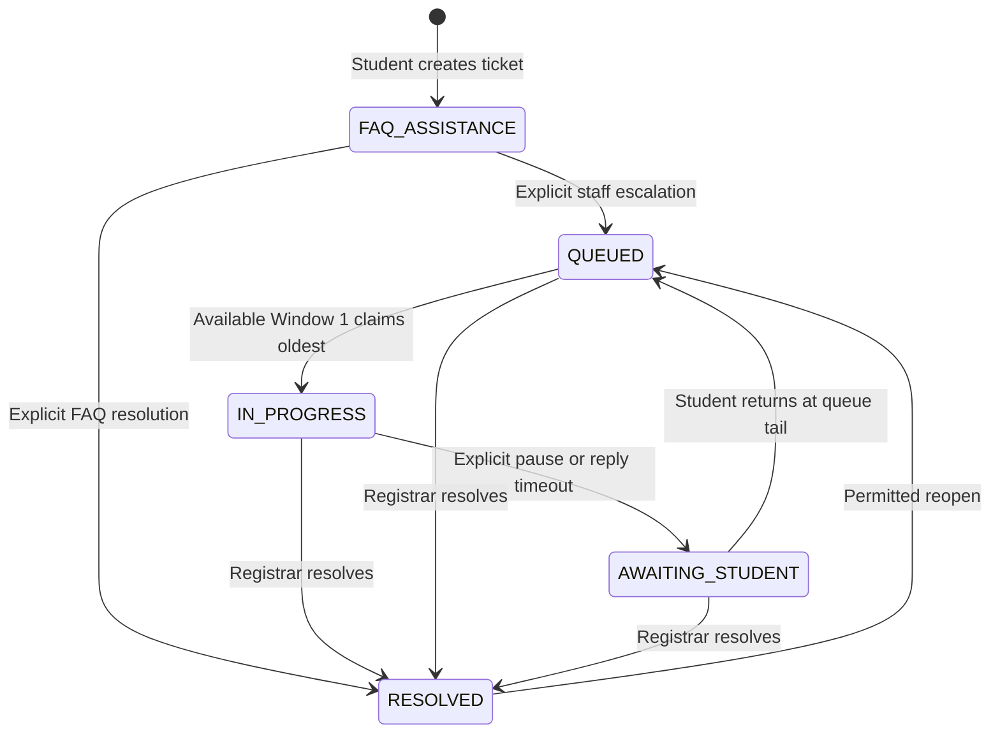

# Project TRACE: System Workflows & Operational Pipeline

The official operational manual for Project TRACE: how someone gets an account, the lifecycle of
every document, and the exact role each administrative desk plays. (The former `APP_GUIDE.md`
described the same roles and the same pipeline a second time; it was merged into this file.)

**Project TRACE** — Tracking, Routing, and Automated Credential Engine — is an end-to-end digital
system for the Pamantasan ng Lungsod ng Pasig (PLP) Registrar's Office. It records document progress, supports college routing and assists staff with intake. Processing-time and error-rate improvements require measured institutional evaluation.

---

## 0. Getting an Account

Everything in section 1 onward assumes the person is already signed in. This is how they get there.

### 0a. Student Registration & AI Identity Verification
- Students sign up with their Student ID, name and password, and **must declare whether they are a
  current student or an alumnus**.
- **Proof of identity:** they upload a valid Student ID or Diploma during registration.
- **AI auto-verification:** the Flask AI engine runs a **3-point check** on the upload — school name,
  student ID and course must all appear in the OCR text. All three matching verifies the account
  automatically.
- If the check fails, the account is held in **pending verification** for manual Registrar Admin
  review rather than being rejected. Text matching cannot establish authenticity or ownership; a genuine document may be inconclusive.

### 0b. Password Recovery
Anyone who cannot sign in — student or staff — uses **Forgot Password?** on the login page.
- Accepts a Student ID, a Staff ID, or the email address on the account.
- The confirmation is **deliberately identical whether or not the account exists**, so the form
  cannot be used to discover which IDs are registered.
- The link works **once** and expires after an hour. Requesting a new one retires the old link, and
  completing a reset retires every other outstanding link for that account.

### 0c. Staff Accounts
Staff are created by the Registrar Admin with a temporary password and a `must_change_password` flag
that clears when they set their own. That is a separate route from 0b, which is for people locked out
of an account they already own.

---

## 1. Universal Document Pipeline

Project TRACE is **evaluate first, pay later**. The registrar cannot quote a price until a document
has been printed, because the College Secretary prices it from the page count — so the work happens
first and money is collected near the end, against a document that already exists.

Every request, whatever its type and whichever channel it arrived through, follows this path:

| # | Status | Whose move | What happens |
| :-- | :--- | :--- | :--- |
| 1 | `PENDING_W1_INTAKE` | Window 1 | The request is filed — online by the student, or typed in at the counter for a walk-in. The clerk checks the paperwork, scans anything the student brought in, and routes it. |
| 2 | `PENDING_SEC_EVALUATION` | Secretary | The assigned-college Secretary checks the student's records; unassigned work uses the college queue fallback. n8n assignment depends on the deployed workflow/configuration. |
| 3 | `SEC_PROCESSING` | Secretary | Accepted, with an **estimated ready date** the student is told. The document is prepared and printed. |
| 4 | `PENDING_STUDENT_PAYMENT` | Student | Printed and priced. The student is told what to pay; Finance is told to expect it. A payment slip is issued for anyone paying at the counter. |
| 5 | `PENDING_FINANCE_VERIFICATION` | Finance | Payment claimed — either the student uploaded proof online, or Finance logged a counter payment. |
| 6 | `PAID_PENDING_SEC_RELEASE` | Secretary | Finance confirmed the money. The Secretary still physically holds the printed document. |
| 7 | `SEC_OR_VERIFIED` | Secretary | The Secretary has inspected the physical Official Receipt handed over by Finance, or its uploaded copy, against the recorded OR number. A paperwork check, not a second payment decision; `payment_status` is untouched here. |
| 8 | `READY_FOR_RELEASE` | Window 1 | The document has physically reached the release desk. |
| 9 | `COMPLETED` | — | Handed to the student. For a walk-in, against the Official Receipt they present. |

**Supported desk rejection actions return the request exactly one step**, with the reason written to the audit
trail. Two deliberate exceptions: Window 1 is the first desk, so returning a request there leaves it
in the intake queue with a note rather than moving it anywhere; and Finance payment clearance is not reversed by a receipt check; refunds are handled off-system. Consult the shared transition map for permitted stage returns. Window 1 has no release-stage return-to-Secretary action.

**Students may cancel only through step 2.** Once the Secretary starts processing, paper and toner
have been spent on a document that cannot be un-printed.

> The status vocabulary lives in `backend/src/utils/documentStatus.js`, mirrored by
> `frontend/src/utils/documentStatus.js`. Nothing else may write a bare status string — that module
> also owns the legal transitions, and every desk action is checked against them before it writes.

---

## 1b. Multi-Document Requests (One Payment, Independent Routing)

A student may tick several document types in a single request — for example a Transcript of Records **and** a Diploma — and pay **once** for the combined total instead of filing separate requests.

1. **Selection**: each selected type expands to its fields (quantity, study years where applicable and supporting evidence). Filing shows rates only; actual printed pages determine page-based final charges.
2. **One request**: all selected documents are created together under a shared **request group**, each with its own tracking number.
3. **Priced one at a time, billed once**: page counts differ per document, so the Secretary prices
   each separately. The request only becomes payable when the **last** of its documents has a price.
   Billing after the first would send the student to Finance once per document.
4. **One payment**: a single receipt — or a single Official Receipt at the counter — settles
   **every** document in the group, and Finance clears them all in one action.
5. **Independent routing**: each document moves through the desks on its own. A Diploma can be
   waiting at Window 1 while the Transcript is still being evaluated; only billing is group-wide.

> Requesting a single document is simply a group of one, so the pipeline in section 1 is unchanged.

---

## 1c. Graduate Application

Only an alumnus (the `user_type` declared at registration, section 0a) sees the Graduate
Application tab at all — a current student cannot reach it, including by navigating to it directly.
The questions are **configured, not coded**: an admin adds, reorders or removes fields, and both the
form and its validation follow automatically. Submissions land in a staff review queue — a
**Graduate Applications** tab on both the Registrar Admin and the College Secretary dashboards (any
staff account can act on one; both roles get the tab so either desk can pick it up) — and move
through `submitted → under_review → approved / rejected`. Approving needs nothing further; rejecting
requires a note, the same as every other reject action in the system.

---

## 1d. Paying: two channels

A student who has been billed can pay either way, and both end at the same desk.

**Online.** The notification carries a link back into TRACE. The student opens the request from their
dashboard, pays through their chosen method, and uploads the reference and proof. The request moves
to Finance for verification.

**At the counter.** The Secretary prints a payment slip — an **Order of Payment** carrying a QR code
of the tracking number, the documents and the total. The student takes it to the Finance Office and
pays. The clerk logs the payment in TRACE, either by typing the Official Receipt details or by
scanning the OR and letting the AI engine fill them in; **either way the clerk re-checks every field
before saving**, because a misread amount here is a money error. Logging a counter payment does not
clear it: it moves to the same verification queue an online payment would.

### Payment acknowledgment, OR issuance and digital copy

Finance may enter the issued OR details or choose Later to defer issuance. Payment clearance immediately sends a payment acknowledgment; an acknowledgment is not an Official Receipt. The actual digital OR is distributed when issued and routed to Secretary for inspection before handoff/release. A physical issued OR can be inspected while Finance's digital retained copy is still pending.

At exactly 4:00 PM Asia/Manila, new same-day OR issuance closes. Deferred receipts have an earliest next-calendar-date value; this is not a working-day/holiday calendar or a promised issuance deadline. Finance sees elapsed time waiting for an OR in Transactions & Export. Publishing a later copy does not repeat payment verification or change document stages.

Secretary's receipt check requires the recorded OR and either an uploaded copy or an explicit physical-inspection acknowledgment. It is distinct from Finance's money decision. Refer to current service validation rather than historical Batch 4 UI-only descriptions.

### Payment methods

Every online method follows the same path — pay, submit proof, Finance confirms — but each asks for
the reference its own channel produces:

| Method | What the student submits |
| :--- | :--- |
| **GCash** | Scan the PLP Finance QR, pay in-app, upload the receipt screenshot + GCash reference number |
| **Credit / Debit Card** | Pay at the Cashier terminal, upload the terminal receipt + approval code |
| **Online Banking / Bank Transfer** | Transfer to the PLP Finance account, upload the confirmation + transaction reference |
| **Over-the-Counter (Cashier)** | Pay cash at the Cashier window, upload the official receipt + its number |

> Payments are **never** settled by a third-party gateway. Every method reconciles against the Finance Office's own records, which is what PLP accounting requires. Methods are managed by the admin, so the Registrar can enable or retire one without a code change.

---

## 2. Document-Specific Workflows & AI Verification

While the pipeline is universal, different documents need different supporting paperwork. That
requirement is now checked at **Window 1 intake (step 1)** rather than at submission: a walk-in
student arrives at the counter with paper and no upload, so the request form prompts for the document
and the intake desk is where it is actually enforced. The clerk can scan it in, and the same OCR pass
runs whether the file came from the student or the counter.

### A. Transcript of Records (TOR) & Diploma
* **Requirements:** None (optional attachments only).
* **Workflow:** Standard pipeline. TOR records Year Started/Year Ended. Filing displays the configured per-page rate, not an estimate; Secretary enters actual printed pages and the server computes the final fee from the saved schedule.

### B. Honorable Dismissal
* **Requirement:** A "Validated Clearance" — uploaded by the student, or scanned at Window 1.
* **AI Workflow:** The EasyOCR engine reads the clearance and records whether its content matches the
  requested document type, writing `ai_verified` or `ai_flagged` to the audit trail. The intake clerk
  sees that reading and decides — the AI assists the decision, it does not make it.

### C. Graduation Clearance
* **Requirement:** A "Signed Departmental Routing Form".
* **AI Workflow:** OCR parses readable text and expected content for staff inspection. Text presence does not prove that departmental signatures are authentic or even present; staff inspect the evidence.

### D. Certificate of Good Moral Character
* **Retired for new requests (CN-03):** Good Moral no longer appears in online or counter document options. The API rejects new requests and Admin cannot recreate, rename or restore retired entries. Historical catalog entries and existing requests remain available; existing requests may finish processing.
* **Historical requirement:** A valid Student ID photo. Historical OCR reads the ID to confirm it matches the requesting student's record.

### E. Official Receipts (Finance, not a document type)
* **Where:** The Finance walk-in logging form, not the student pipeline.
* **AI Workflow:** The third OCR mode reads an Official Receipt for its number, total and date so a
  clerk verifies figures instead of transcribing them. It takes the **largest** peso figure on the
  receipt, since a receipt lists line items before its total and reading a line item as the amount
  paid would under-record the payment. Every field is re-checked by the clerk before saving.

---

## 3. Command Center Workflows (By Role)

### 🧑‍🎓 Student Dashboard
* **Role:** The initiator.
* **Workflow:**
  1. Submits a request for one or more documents. **Nothing is paid at this point** — the form shows
     the configured rates without an estimated total. The server computes page-based final amounts after preparation.
  2. Attachments are optional here. A required supporting document can be uploaded now or brought to
     Window 1; the intake desk checks for it either way.
  3. Watches the **Live Tracker** — nine stages, driven by the same pipeline definition the backend
     uses, so the student's view can never describe a process the office no longer follows.
  4. When the Secretary prices the request, an **Action Required** banner appears with the amount.
     This is the one state where nothing moves until the student acts, which is why it gets a banner
     rather than a row in a table.
  5. Pays online from that banner, or takes the printed slip to the Finance Office.
  6. Receives **SMS & email** at the moments that need action or planning: the estimated ready date,
     the amount due, and the document being ready for pick-up.

### 💰 Finance Clerk (`FINANCE001`)
* **Role:** Revenue guardian. **The only desk that can mark a document PAID.**
* **Workflow:**
  1. **Awaiting Payment** — read-only. Shows what each student has been billed, so a clerk can answer
     someone who walks up holding a slip, and can log a counter payment against the right request.
  2. **Log Counter Payment** — records a cash payment. Scan the Official Receipt to pre-fill the
     number, amount and date, then confirm each field by eye. Works with the AI engine stopped: the
     form falls back to manual entry, because a student is standing at the counter either way.
  3. **Verification Queue** — the actionable one. Compare the proof against the Finance Office's own
     records and approve or reject. Finance may record the issued OR or defer issuance with Later. Clearing payment is what sets
     `payment_status = PAID` and returns the document to the Secretary for an OR check before handoff;
     rejecting sends it back to the student with the reason.

> The Secretary sets the **price**; Finance confirms the **payment**. Those two authorities are
> deliberately held apart — it is what makes the money trail auditable. The Secretary's later OR
> Verification step (below) does not change this: it checks the physical OR or its uploaded copy
> against the recorded number and never writes `payment_status` itself.

### 📜 College Secretary (`SEC-CCS001`, `SEC-CON001`, … one per college)
* **Role:** Academic evaluator, and the desk that does the actual work. Four queues, because a
  document sitting in one is waiting on something different from the others.
* **Workflow:**
  1. **Initial Evaluation.** Documents arrive **only for their own college** — n8n routes each one to
     the secretary matching the student's college, so a CCS document appears in the CCS queue and in
     no other. A document filed while n8n is stopped is left unassigned and falls back to the college
     filter, so the pipeline never stalls on the orchestrator being down.
     The clerk corrects anything the OCR misread, then accepts the request with an **estimated ready
     date**. That date is required: it is what the student plans around, and what the office is
     measured against.
  2. **Processing & Pricing.** Prepare, print, sign and dry-seal the document. Enter actual printed pages; the server calculates the amount from the saved Admin fee schedule, copies and itemized charges. The breakdown and clerk identity are recorded. An amount whose origin is unknown cannot
     be defended when a student disputes it.
     Pricing the **last** document in a request bills the whole request: the student is notified,
     Finance is notified, and the payment slip is produced.
  3. **OR Verification.** Once Finance confirms the money, inspect the physical Official Receipt
     handed over by Finance, or its uploaded copy, against the recorded OR number. With no uploaded
     copy, explicitly acknowledge physical inspection; the existing verification notes record it.
     This is a paperwork check and never sets `payment_status`; only Finance does that.
  4. **Final Handoff.** Physically pass the printed document to Window 1 and record it. This is a
     separate step on purpose — it marks a real physical event, and marking it while the document sits
     in a drawer is exactly the drift this pipeline exists to stop.
  5. **Graduate Applications** (shared with the Registrar Admin, section 1c). Review an alumnus's
     submitted answers and approve or reject, with a required note on rejection.

### 🏢 Window 1 Clerk (`WINDOW1001`)
* **Role:** The counter at both ends of the pipeline.
* **Workflow:**
  1. **Intake Queue** — the first human look at every request. Confirm the paperwork, scan whatever a
     walk-in student brought in (the same OCR pass an online upload gets), then route to the College
     Secretary or return it to the student with a note saying what to fix.
  2. **File a walk-in** — type in a request for a student at the counter. It enters the intake queue
     unpaid exactly like an online submission, so a walk-in cannot skip its own evaluation or its bill.
  3. **Release Queue** — hand the finished document over. The Official Receipt number is shown on the
     row, with a **View** link when Finance has uploaded its retained copy. Otherwise the row says
     **Digital copy pending upload**. The Secretary has already inspected the OR before handoff;
     absence of the digital copy does not block release.
     Releasing closes the request and notifies both the student and the Secretary who prepared it.
  4. **Tracking Desk** — every document in the system, at any stage. This is the window a student
     walks up to and asks "where is mine?", which is why it is deliberately **not** filtered down to
     the two queues Window 1 acts on.

### 👑 Registrar Admin (`ADMIN001`)
* **Role:** Overseer and Optimizer.
* **Workflow:**
  1. Does not handle individual documents.
  2. Monitors the **AI Insights Panel** (Random Forest) for queue bottlenecks (e.g., "Warning: Secretary queue is backing up").
  3. Uses **Predictive Analytics** (Prophet ML) to forecast 7-day document volume, allowing the admin to schedule more clerks on predicted busy days.
  4. Manages **System Maintenance → Accounts** and the separate **Account Verification** review queue, verifying or rejecting the accounts
     that failed automatic AI verification at registration (section 0a), and administering staff
     accounts, document types and colleges.
  5. Monitors the global **Activity Logs** (`step_logs` audit trail) to maintain total system accountability across all desks.
  6. **Graduate Applications** (shared with the College Secretary, section 1c). Review an alumnus's
     submitted answers and approve or reject, with a required note on rejection.

---

**See also:** `docs/ENV_SETUP_GUIDE.md` for configuration · `docs/BACKEND_GUIDE.md` for the endpoints
behind each step · `docs/ALGORITHM_COMPUTATION.md` for how the OCR, forecast and classifier actually
compute.

## Batch 8 Account and Presentation Flow

Registration proof selection is local until the existing confirmed registration submission. Each AI HTTP call has a 15-second timeout covering connection and response-body parsing. Unavailable/inconclusive identity verification retains the existing pending/manual-review fallback. The signup response exposes only approved verification-reason copy; internal engine exception details are not sent to the applicant. Active administrators receive a bell entry linking to that applicant's Review dialog.

Login OTP uses its own code/expiry; email-change codes carry a purpose marker, so old shared codes cannot verify a new address. Staff OTP sign-in completes before a browser-recognition record or alert is created. Successful logins compare a hashed random recognition cookie against that user's `user_devices` records; a newly seen browser, including the first successful login, generates in-app and email notices. IP/user-agent metadata describes the login and does not decide identity. Recognition is not a JWT session or a revocation mechanism. Cookie loss/privacy blocking means the browser may be recognized as new again.

Phone changes persist normally. An email change is staged as a pending address, separate from login OTP; the previous address stays active until a valid, single-use verification link commits it. Profile Verify initiates ownership verification. The frontend fetches the fresh profile after that commit and refreshes its cache. Student/alumni identity and graduate-completion reads use the student identifier in `grad_applications`; alumni dashboard access unlocks after a submission exists, independently of review approval. A failed post-save profile refresh preserves submission success and asks for a page refresh rather than reporting the saved application as failed. This is a frontend onboarding gate, not new authorization on every API endpoint.

Admin account edits are restricted to full name, email, phone, course/program, and a valid college reference. IDs, roles, verification, and activation are not editable through the new profile endpoint. Existing staff activation/password permissions are unchanged. Registered Users navigation merges into Maintenance's Accounts section; old tab URLs remain compatible.

Window 1 shares an Intake/Release workspace beside the upload card. Intake notes and confirmation remain required for return; release shows attachment information alongside request details. Finance hands the physical OR to Secretary and may upload its retained copy later. Receipt selection is local, OCR runs on **Read Receipt**, and recording still requires confirmation. No new return-to-Secretary route or digital-attachment release prerequisite was introduced.

Students share one History table with request/payment filters. Reports retain API pagination and filter-aware machine-readable CSV; only on-screen timestamps/amounts are formatted. Existing paginated Window 1 queues/tracking, Admin tracker, and Reports use measured viewport row capacities. Finance and Secretary queues and account card grids do not gain pagination. The forecast card/modal share one zero-based scale with headroom, calculated from the unfiltered seven-day data.

The pipeline order/vocabulary is unchanged. Mobile tracker nodes derive from `PIPELINE`; desktop remains horizontal. Legacy APPROVED/REJECTED records stay outside the active pipeline with zero active progress; rejection has a red status treatment. Help/FAQ reflects the user manual, and **Preferences** contains appearance controls; the avatar opens **Edit Profile**.

## Batch 8b Eligibility, Identity, and Staff Review

The new-alumni signup ID is stored in the existing `users.student_id` login key. Existing identifiers are not migrated. Signup saves a validated active `college_id`; legacy `course` remains compatible with routing. The explicit 8b migration backfills only byte-exact college-name matches. Degree/program names and unknown mappings are never guessed; the profile warns that Admin review is needed.

`document_types` owns audience, repeatability, counter-only, original-document, fixed registrar-attachment, and same-day settings. `document_type_colleges` owns the allowed-college list; an empty list means unrestricted. Admin saves settings and junction rows in one transaction. Student reference-data reads expose eligibility reasons, and both online and counter filing enforce audience/college/repeat rules against the **target student**, not the clerk. Window 1 and Secretary approval recheck those rules. Existing inactive types can continue processing; deactivation blocks new filing. No stage is added or reordered.

The filing transaction locks the target user before checking prior requests, serializing simultaneous nonrepeatable submissions. Every existing document except terminal legacy `REJECTED` blocks a repeat, including `COMPLETED`; cancellation deletes the document. Secretary rejection is an active return to Intake and continues to block duplicates. Requested quantities must be positive integers within the SQL range; nonrepeatable types permit one. The backend preserves copies for server final pricing; filing displays rates only. Secretary final pricing and Finance payment authority remain separate.

A raw attached counter scan may be staged without an identifier for human review. Restricted types cannot pass Secretary evaluation without a recognized student and eligible college/applicant type. This exception does not bypass rules for a typed, identified walk-in. The four same-day walk-in types remain subject to Admin activation and fee review, and require original plus photocopy presentation under the Registrar policy. Case-specific supporting-document requests now appear in authorized linked Support conversations; uploads and reviews preserve version history. They do not introduce an automatic document-pipeline hold or reorder its stages.

Signup OCR is explicitly requested, temporary, bounded, and advisory. It fills only empty fields, discards results after file/account-type changes, and falls back to manual entry. It neither creates an account nor approves it. Saved registration proofs are surfaced through the existing protected file endpoint. Full-profile lookup is limited to Admin and the Window 1, Secretary, and Finance desks and never returns authentication secrets. Verification previews already existed in the account, intake, Secretary, Finance, and OR dialogs; those implementations are reused.

Acknowledgment feedback and bell popups dismiss on SPA navigation or leaving the browser tab. Queue/maintenance/security tab changes dismiss their feedback. Draft forms and pending confirmations remain intact. Preferences contains only local appearance; Edit Profile retains personal, educational, and security functions. Window 1 and Secretary reuse Admin's report/export UI with existing server permissions.

## Registrar Consultation — CN-03/CN-04

Good Moral is retired from request options and blocked by the server for new online/counter submissions, including unidentified scans. The policy recognizes the three existing repository names and normalizes case/whitespace. An existing Good Moral request can still advance; changing another request into Good Moral cannot bypass retirement. Secretary Approve and Return both reject that type change before saving, logging or sending notifications; unchanged historical Good Moral types may still be approved or returned. Admin sees the historical type as retired and cannot create, edit, rename or restore it. Historical records, OCR classifications and status filters are retained.

Diploma uses an editable **₱250 reissue default**. This is a configured informational rate; Secretary preparation and server pricing determine the final amount. `migrate_cn03_cn04.js` changes a catalog Diploma fee of ₱50 to ₱250 once, without changing existing request amounts or other configured fees. Its completion marker and catalog updates commit together in an InnoDB transaction. Failure rolls them back; subsequent runs leave later fee edits intact. The full migration's seed also preserves existing Diploma fees.

From the repository root, deploy the data changes with `node backend/database/migrate_cn03_cn04.js` using the configured database. The main migration invokes the same guarded change. Do not run the older `migrate_b9.js` for this scope: its name mismatches and attachment changes have not been reconciled. The development verification uses mocked models/connections; no live migration was applied.

That consultation originally deferred Program/Course and online-submission QR. The current repository now implements the approved Program catalog, submission QR, quantities, per-page final pricing, durable numbering, templates and case-specific requirements. Automatic holds and delay-notification policy must not be inferred from those additions. See `PROGRESS.md` for the code findings that supersede the earlier Batch 9 completion claims.

## Support ticket redesign — local implementation, matched deployment required

The current repository replaces the historical per-student/per-document split with one Support ticket workspace. [SUPPORT_DESIGN.md](SUPPORT_DESIGN.md) defines state, role, queue, hour, file and metric policies; [SUPPORT_VALIDATION.md](SUPPORT_VALIDATION.md) records local evidence. Deploy the matching explicit migrations, API, AI image and frontend before demonstrating this flow on the live site. Terminal-case API write guards apply independently of support-ticket state.

## Unified Support lifecycle

Staff-opened linked cases and imported histories begin Queued. One unresolved general ticket per student and one live ticket per Window 1 clerk are enforced by locks and database uniqueness. Closed/cancelled document cases remain read-only regardless of support state. FAQ is maintained text; human/live support phrases and Talk to staff escalate the same ticket. Defaults are Mon–Thu 08:00–16:00 Manila; explicit response clocks pause outside hours and retain their starting settings. Availability/position are durable; ETA requires observed handling samples and available capacity.

The composer stays below an independently scrolling history. Ticket/message/requirement cursors keep older records reachable. Approved supporting-document IDs prevent ordinary duplicates, while rejected uploads and explicit replacements preserve versions/events. Cancellation retains history and private file authorization. See [USER_MANUAL.md](USER_MANUAL.md#6-get-support-and-submit-case-documents) for user steps and [SUPPORT_DESIGN.md](SUPPORT_DESIGN.md) for metrics/permissions.
